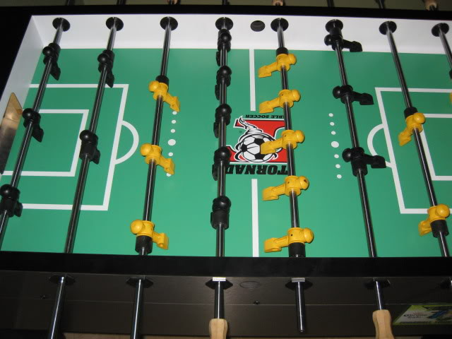
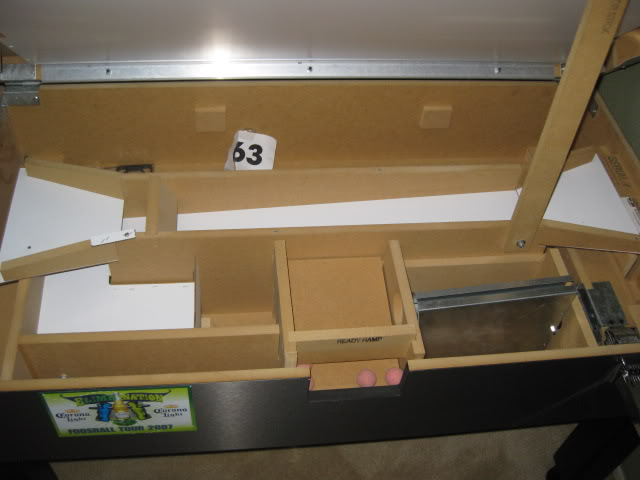

# Table of Contents
 * [Project Names](#project-names)
 * [Ideas](#ideas)

# Project Names

 * Torando Tracking Tool
 * Torando Tournament Tool

or something... those two suck.

(via http://s268.photobucket.com/user/brian302_bucket/media/IMG_1027.jpg.html and http://s268.photobucket.com/user/brian302_bucket/media/IMG_1028.jpg.html)

# Ideas

**Update!!**  I found this project, which I think we should at least use as a starting point: [Digital Foosball](https://github.com/sinnerschrader/digitalfoosball), (http://digitalfoosball.com/)

In general, the idea of the project is to create a non-destructive solution for adding electronic interface to common foosball tables (Valley-Dynamo Tornado,
probably others).

Going for fastest proof-of-concept (well, probably want to go for prototype quality, as we don't own the table and it's
actively used; best to avoid annoying everyone else) in first attempt.  Arduino-based solution likely due to familiarity;
WiFi shield (and now, the digitalfoosball project).

## Idea tree
 - audio driver + speaker
  - derp...
 - real-time clock
  - time of play, game length, etc.
 - photo diode based goal sensing
  - slim and non-intrusive to fit inside table and not interfere with ball return
 - accelerometer based
  - table level sensing
  - sensing table movement
   - players bumping table, playing rough, etc.
   - possibly shots on goal, or other more detailed measurement?!
 - player identification mechanism
  - keypad-based PIN/key/ident entry
  - EM/RF based identification
   - system specific issued cards/widgets (NFC/RFID, mag-strip, ...)
   - phone/tablet/device (NFC/RFID, BT, WiFi)
   - other things the player might have (CC, drivers licence, ident. card, etc.)
  - voice?  lol...
 - electronic connectivity (**wireless (WiFi, also ad-hoc/p2p/mesh WiFi, for e.g. auth?)**, wired, ...)
  - stat tracking
   - scores, games played, (shot attempts,) etc.
   - game time, "roughness of play,"
  - access control, auth/auth
  - environmental tracking (temperature, "movement" (accelerometer), ...) ??
   - make system easy to extend (generally) ??

## Further ideas
 - camera(s) watching table top
  - ball tracking
   - AI (assuming way to control shafts...)
   - analytics
  - instant replay/online viewing
 - AI/shaft control
